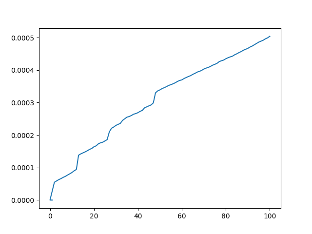

# CS3980_1

Here is the plot of time taken on the y-axis and n on the x axis. You can see that as we increase n (the nth fibbonacci number), the time taken increases as well. We see it looks pretty linear, suggesting a O(n) time complexity of the function, which is what we expect since the work to get fib(n) is just n constant time operations (namely addition). 

My code uses a decorator to time the function, and matplotlib to plot make a plot.